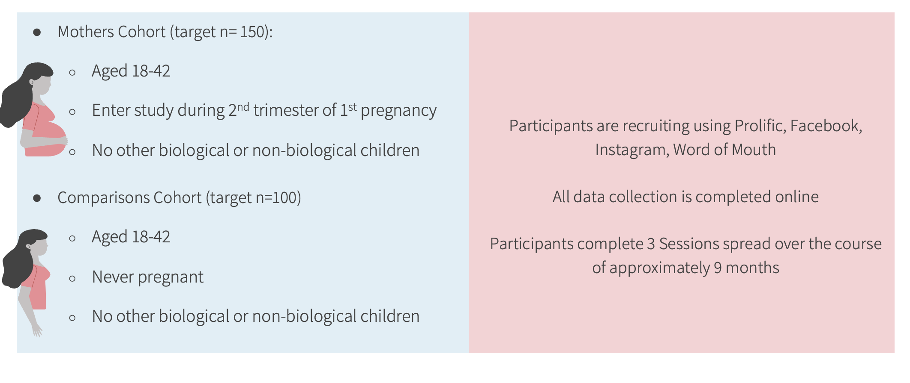

# Overview

## Summary 

## Aims

**Specific Aim 1:** Identify whether there are differences in interoceptive ability in pregnant women, relative to never pregnant women.

**Specific Aim 2:** Establish whether individual differences in interceptive ability are associated with incidence of depression in women during pregnancy, and in the early postpartum period.

## Background

Interoception refers to the perception of the internal physiological state of the body (e.g., heart rate, hunger, taste, muscle tension etc.). Such bodily awareness is required for physiological regulation, and is thus a critical component of homeostatic functioning [4]. Interestingly, dysregulation of interoception is increasingly recognized to play an important role in mental health, potentially acting as a transdiagnostic vulnerability mechanism, increasing susceptibility to a range of mental illnesses (e.g., depression; [5]). Further underscoring the importance of interoception to emotional health is evidence that interoceptive difficulties are associated with trait levels of alexithymia – a chronic impairment in emotion recognition and understanding [6]. The developmental literature also supports the interoception- emotional health link. Interoceptive ability changes across development, declining in adolescence – an age where many mental illnesses first emerge [5]. It has been suggested that the massive physiological changes to the adolescent body occurring during puberty may contribute to the decreases in interoceptive ability at this time [5].

Pregnancy and the peripartum period are another stage of life characterized by heightened susceptibility to mental illness, particularly depression, as well as tremendous physiological change, as the body continually adapts to the growing fetus, the birth, and subsequent mothering [7]. Given these changes, it stands to reason that decreases in interoception may also occur during pregnancy, potentially increasing the risk of perinatal depression. However, there are no studies which have examined interoceptive changes during pregnancy and postpartum, nor how said changes are associated with risk for mental illness in the perinatal period. Thus, the goal of the proposed project is to assess interoceptive function in pregnant females, relative to a never pregnant group, and establish whether individual differences in interoception during pregnancy are related to perinatal symptoms of depression (Figure 1). The data from this project will serve as pilot data for a large federal grant which will extend the assessment of interoceptive awareness during pregnancy to pregnancy-specific internal signals (e.g., fetal movements), examine the impact of interoception on additional outcome measures in the peripartum period, e.g., mother-child attachment and child emotional functioning, and determine how demographic factors associated with peripartum depression (e.g., race, income, education) may contribute to breakdowns in maternal interoception (Figure 1).

Perinatal depression affects up to 20% of pregnant women and mothers [8], and many more women experience subclinical depressive symptoms. Beyond the impact of perinatal depression on maternal health and wellness, this condition is also an adverse caregiving environment for the developing child – depressed women engage in less sensitive and responsive caregiving, and such parenting practices, once established, can persist beyond the resolution of the depressive symptoms [9,10]. The consequences of maternal depression on the child are extensive, including lower infant weight gain, poorer motor development, higher incidence of gastrointestinal and lower respiratory tract infection, reduced interpersonal and cognitive functioning, and greater behavioral and emotional problems [11–13]. Adults who had a depressed mother are also more likely to be depressed, contributing to perpetuated cycles of adversity across generations [14]. As such, studying the factors associated with peripartum depression fits into my wider research program examining the intergenerational impact of childhood adversities on child health and wellness. By focusing on interoception, a heretofore unstudied function in pregnancy, this study has the potential to revolutionize our understanding of maternal wellbeing, a topic that has too long been neglected in the biomedical research sphere.